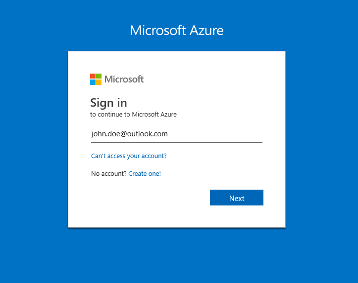

# Workshop 2: Data Science Hands On

## Introduction

Before the team can begin working on Data Science topics, everyone needs to have a development environment set up with approriate tools. This workshop will get you ready to begin developing, and includes hands-on experience with the following elements:

* Signing in to Azure
* Set up & use Ubuntu DSVM
* Modeling lifecycle using ML Studio and SDK
* Model deployment
* Using Databricks cluster as a compute target
* Using PowerBI to visualize results

Take a look at these repos for additional content ideas:

* [Azure ML SDK for Python Docs](https://docs.microsoft.com/en-us/python/api/overview/azure/ml/intro?view=azure-ml-py)
* [Jupyter notebooks](https://github.com/Azure/MachineLearningNotebooks)
* [Samples for AI](https://github.com/Microsoft/samples-for-ai)

## Signing into Azure

To get started you'll have to sign into Azure through the Azure portal at [portal.azure.com](https://portal.azure.com). From here you can manage all of your resources and subscriptions.

## Set up & use Ubuntu DSVM

[Section 2.2](02.2-DSVM.md) explains how to set up a Ubuntu Data Science Virtual Machine in Azure, provides an introduction to Jupyterhub, and details the steps you need to take to read and write data from Azure Blob Storage.

## Modeling lifecycle using Azure ML Python SDK and Azure Databricks

[Section 2.3](02.3-AMLwithDatabricks.md) explains how to set up Azure ML Python SDK in Azure Databricks, prepare data, build model, train and deploy.

## Model deployment

[Section 2.4](02.4-ModelDeployment.md) goes over the various ways you can deploy your ML model to Azure. This includes using our Machine Learning Python SDK, or open-source alternatives like [Flask](http://flask.pocoo.org/) and [Django](https://www.djangoproject.com/).

## Using Ubuntu DSVM as a compute target

A compute target is the resource that runs your training script or hosts your model when it's deployed as a web service. Azure ML Python SDk can create and manage a new compute target, or attach the existing one to the ML workspace. Data Science Virtual Machine (DSVM) running Ubuntu can be compute target, and that supports GPU acceleration, automated hyperparameter tuning, automated model selection, and can be used in pipelines.

Review [DSVM as Computer Target Steps by Step instruction](https://docs.microsoft.com/en-us/azure/machine-learning/service/how-to-set-up-training-targets#dsvm). This is [Jupyter Notebook](https://github.com/Azure/MachineLearningNotebooks/blob/master/01.getting-started/04.train-on-remote-vm/04.train-on-remote-vm.ipynb) that demonstrates training on a Data Science Virtual Machine.

## Using PowerBI to visualize results

[Section 2.5](02.5-PowerBI.md) highlights how to use Power BI to gain insight into your data and visualize your results.
