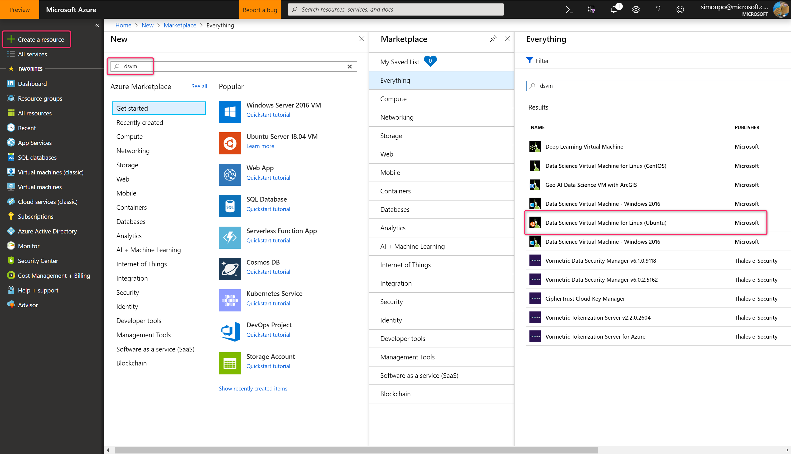
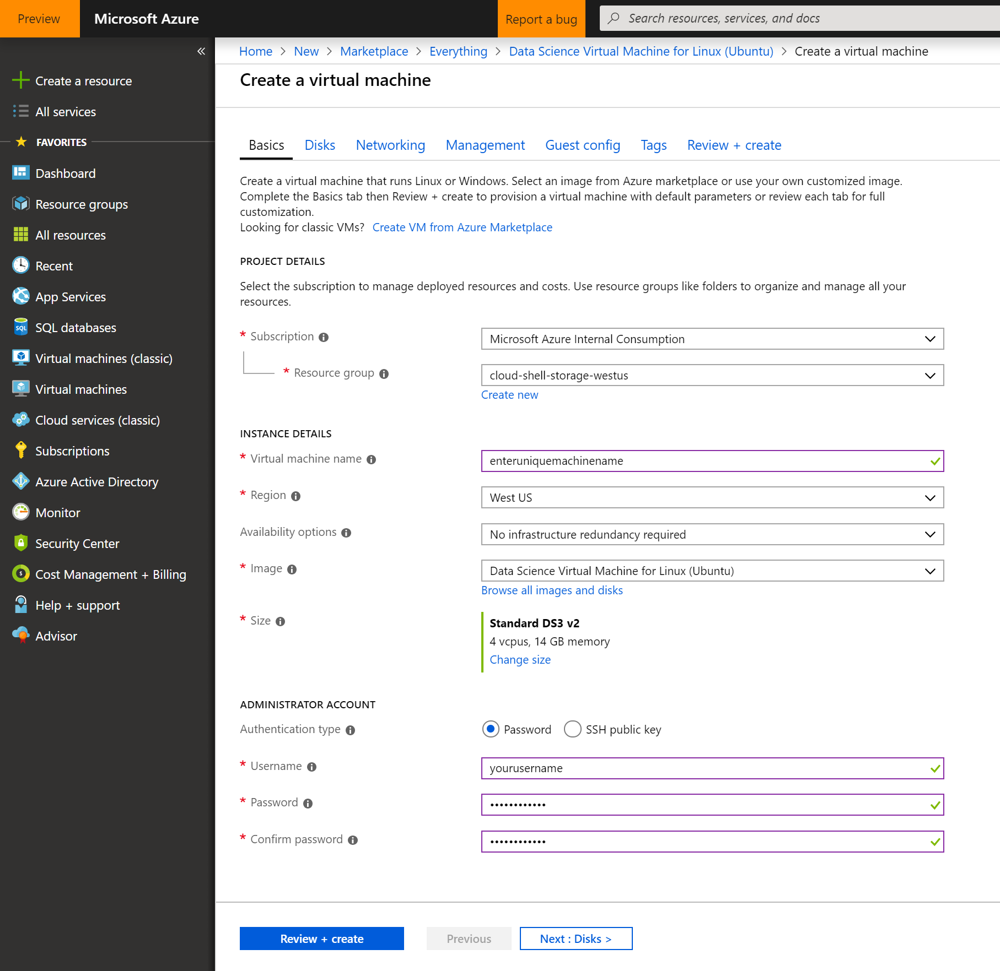

# Workshop 2.2: Setting up your DSVM

## Introduction

DSVMs are Azure Virtual Machine images, pre-installed, configured and tested with several popular tools that are commonly used for data analytics, machine learning and AI training.


In this section of the workshop, we'll learn how to:

* Set up and sign in to your Ubuntu-based DSVM
* Configure Jupyterhub for data science work
* Install the Python packages we need for data science
* Connect to data sources
* Build and train a model

## Setup and sign in to your Ubuntu-based DSVM

Before the team can begin working on Machine Learning and Data Science tasks, everyone needs to have a development environment that will work well with common Python libraries.

## Challenge

Set up an environment that is conducive for Machine Learning tasks. It should include:

* Python 3.6
* Jupyter or JupyterHub access
* pip (Python package manager)
* See additional (optional) tools [here](#optional)

This environment can take advantage of cloud Data Science specific [Azure](#linux-dsvm) tooling or a [Local](#local-computer) Data Science setup on your machine.

### Ubuntu DSVM

This setup has been found to help the team work together in a consistent environment. 

We've commonly found the following setup to work very well:

* Ubuntu Data Science Virtual Machine (DSVM)
    * OS:  Ubuntu
    * Size:  CSP _DS12 v2_ (4 /	28.00 GiB	RAM / 56 GiB Temporary Storage)	 - optimized for memory and a medium workload
    * Region:  West Central US
    * This will also include:
      * Python 3.6
      * Jupyterhub
    * Setting up one DSVM for the whole group and logging in with Jupyterhub is best to foster collaboration and consistency
    * See [References](#references) for more guidance and help

#### Create your DSVM
Sign in to the [Azure portal](https://portal.azure.com), select Create a resouce, and search for dsvm in the New resource blade. 

Select "Data Science Virtual Machine for Linux (Ubuntu)" from the list of available machine images, as shown below, and select "Create".



You'll then begin to enter the details needed to create your DSVM.

Under the Basics section, follow the prompts, which are generally self-explanatory. You should select a datacenter close to you, so if you're in Factoria choose West US.

Make sure to use all lower case characters for your machine name and login name, and for this exercise select "Password" for your authentication type.



Once your DSVM is created, you can begin to use it immediately. 

## Connecting via SSH

After the VM is created, you can sign in to it by using SSH. Use the account credentials that you created in the Basics section of step 3 for the text shell interface. On Windows, you can download an SSH client tool like PuTTy. If you prefer a graphical desktop (X Windows System), you can use X11 forwarding on PuTTy or install the X2Go client.

## JupyterHub and JupyterLab

The Ubuntu DSVM runs JupyterHub, a multi-user Jupyter server. To connect, browse to https://\<your-vm-ip\>:8000 on your laptop or desktop. You may see a certificate error when you visit this URL. To get past this in Edge select "Details > Go on to the webpage", and in Chrome select "Advanced > Proceed to \<your-vm-ip\>".


From here you will be shown the Jupyterhub login form. Enter the username and password that you used to create the VM, and sign in. Many sample notebooks are available for you to browse and experiment with.


JupyterLab, the next generation of Jupyter notebooks and JupyterHub, is also available. To access it, log in to JupyterHub, then browse to the URL https://\<your-vm-ip\>:8000/user/your-username/lab. You can set JupyterLab as the default notebook server by adding this line to /etc/jupyterhub/jupyterhub_config.py:

```python
 c.Spawner.default_url = '/lab'
```

* See data download instructions [here](#data-downloads)
* Determine whether any [optional](#optional) installs should be added to team members' environments

## Success Criteria

* Run 2 code cells, one with each of the following command blocks to ensure successful setup.
  ```python
  import sys
  sys.version
  ```
```bash
  !{sys.executable} -m pip freeze
  !{sys.executable} -m pip --version
  ````

## References

### Ubuntu DSVM

* Create a Linux Data Science Virtual Machine (DSVM) and use JupyterHub to code with your team - [Video](https://www.youtube.com/watch?v=4b1G9pQC3KM) or [Doc](https://docs.microsoft.com/en-us/azure/machine-learning/data-science-virtual-machine/linux-dsvm-walkthrough#jupyterhub)

### Data Connection
PLACEHOLDER
* For the cloud setup, with the DSVM, a convenient way to download the data is through OS commands within a Jupyter notebook, e.g.:

    ! curl -O https://pathtodata.blob.core.windows.net/datafiles/gear_images.zip

### Optional
* PuTTY [Download](https://www.putty.org/) - or your favourite SSH client
* Git [Download](https://git-scm.com/downloads)
* Azure ML SDK for Python [Install](https://docs.microsoft.com/en-us/python/api/overview/azure/ml/intro?view=azure-ml-py)

Using installed tools
* 

## References
[Data Science Virtual Machines](https://azure.microsoft.com/en-us/services/virtual-machines/data-science-virtual-machines/) - comprehensive pre-configured virtual machines for data science modelling, development and deployment.