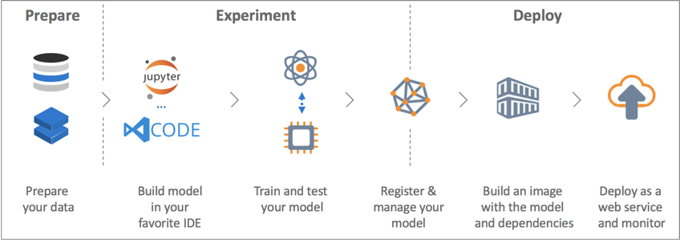

# Workshop 2.3: Azure Machine Learning with Databricks

## Introduction
Machine learning is a data science technique that allows computers to use existing data to forecast future behaviors, outcomes, and trends. Forecasts or predictions from machine learning can make apps and devices smarter.

Azure Machine Learning service provides a cloud-based environment you can use to develop, train, test, deploy, manage, and track machine learning models. Open-source technologies are fully supported. You can use tens of thousands of open-source Python packages with machine learning components such as TensorFlow, Scikit-learn, PyTorch, CNTK, and MXNet. Azure Machine Learning service also includes features that automate model generation and tuning to help you create models with ease, efficiency, and accuracy. Use Machine Learning service if you work in a Python environment, you want more control over your machine learning algorithms, or you want to use open-source machine learning libraries.



The Azure Machine Learning SDK for Python (aka Azure ML Python SDK) is used by data scientists and AI developers to build and run machine learning workflows upon the Azure Machine Learning service. You can interact with the service in any Python environment, including Jupyter Notebooks, Visual Studio Code or your favorite Python IDE.


In this section of the workshop, you will learn how to:
* Setup Azure ML Python SDK in Azure Databricks
* Mount Azure storage
* Build model in Azure Databricks with a Spark ML Pipeline
* Train model and also capture run history (tracking) with Azure ML Python SDK
* Deploy model to Azure Container Instance (ACI) with Azure ML Python SDK
* Deploy model to Azure Kubernetis Service (AKS) with Azure ML Python SDK from an existing Image with model, conda and score file


## Setup Azure ML Python SDK in Azure Databricks
Click on "Azure Databricks" at left top corner to go home of the workspace.  
Click on "Import Library" under "common Tasks" section located at left bottom half.  
Choose "Upload Python Egg or PyPI" as language.  
Specify "azureml-sdk[databricks]" as the PyPi Name.  
Click on "Install Library" button.  
Click "Confirm" button to automatically attach this library to all running and future clusters.  
Setup is now complete.

## Mount Azure Storage
Note that this is one time activity ideally performed by one person and then all users can simply start using the mount point.  
Copy storage account key as a secret in the Azure Key Vault. The name you give here is the <key-name>.  
Append "#secrets/createScope" to your databricks URL in the browser and you will able to create the scope. This is the <scope-name>.  
Use following code example in Notebook and execute to mount and validate.  
This is how you can mount without copy/pasting the key around.

```
# Fill in your values
containername = "<your-container-name>"
storageaccountname = "<your-storage-account-name>"
# Mount
fssource = "wasbs://"+containername+"@"+storageaccountname+".blob.core.windows.net"
mountpoint = "/mnt/"+containername
confkey= "fs.azure.account.key."+storageaccountname+".blob.core.windows.net"
dbutils.fs.mount(source = fssource, mount_point = mountpoint, extra_configs = {confkey:dbutils.secrets.get(scope = "<scope-name>", key = "<key-name>")})

# Verify
display(dbutils.fs.ls(mountpoint))
```
